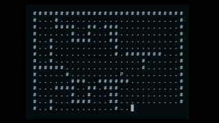

*This app is a .NET 7 console application*

**Gridworld**

**C# | .NET | Reinforcement Learning | Q Learning | Console App**

Gridworld is a great example of programming a simple agent that is able to learn to play the game by playing it! This approach is called reinforcement learning [[wiki]](https://en.wikipedia.org/wiki/Reinforcement_learning).

---

The environment is a grid with the following types of cells:
- **Wall**. The player can't move there. Attempting to move into a wall will result in a 'punishment' so that the agent learns to not do that in the future.
- **Empty cell**. The player can freely navigate the cells. There is a small negative reward associated with empty cells to make it less likely for the agent to get stuck in an already explored area.
- **Goal cell**. Entering this cell will result in winning the game for the agent.  

The number of moves that are available to the agent are limited. Not finding the goal cell on time means that the agent lost this round. The max number of moves can be adjusted in the GameParameters class.

---

The maps are specified with files. So you can create your own map and challenge the agent! You might need to tweak some parameters as larger maps might require more available moves to learn and find the goal cell. The examples of maps are available under the Maps folder.

---

To run the app, run "dotnet run" in the terminal.
